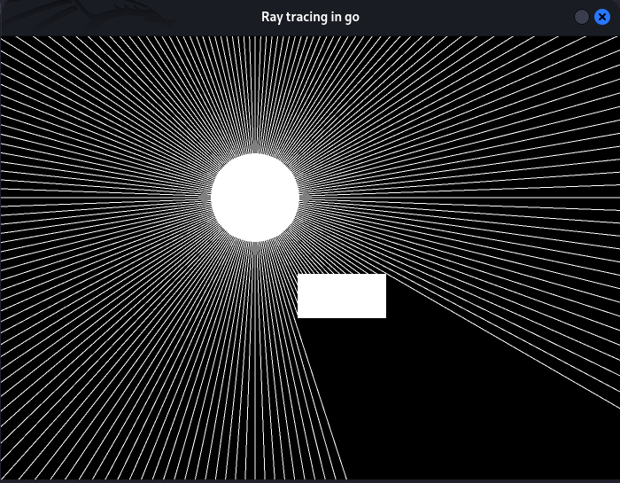

# 🌟 Ray Tracing in Go

An interactive ray tracing demo using [Ebiten](https://ebiten.org/), written in Go. Casts dynamic light rays from a source and visualizes ray-object intersections in real time.



## 🚀 Features

- Dynamic ray casting from a light source
- Real-time mouse interaction
- Rectangle collision detection with rays
- Simple and extensible Go structure

---

## 📦 Requirements

- Go 1.21 or higher
- Git
- [Ebiten](https://ebiten.org/) (automatically handled by `go mod`)

---

## 🛠️ Installation & Running

```bash
# Clone the repository
git clone https://github.com/Caaki/RayTracingWithGo.git
cd RayTracingWithGo

# Get dependencies and run
go run main.go
